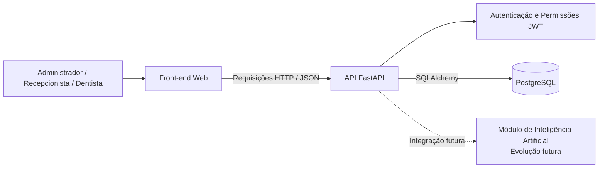
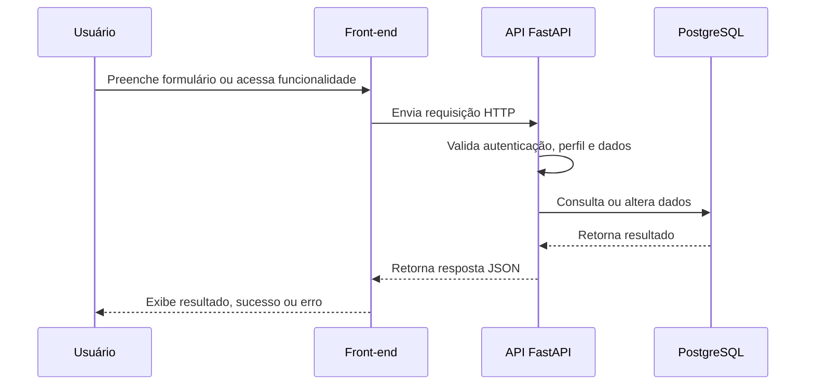

# Arquitetura do Sistema — Lumina Odonto

## 1. Objetivo

Este documento apresenta a arquitetura do sistema Lumina Odonto, uma aplicação de gestão para clínicas odontológicas.

A solução busca centralizar o gerenciamento de usuários, pacientes, agendamentos, prontuários e evoluções clínicas. Na Sprint 4, o foco está no primeiro módulo funcional: autenticação, controle de perfis, cadastro de usuários da equipe e gestão de pacientes.

## 2. Visão geral da solução

O Lumina Odonto utiliza uma arquitetura cliente-servidor.

O usuário acessa o sistema por meio de uma interface web. O front-end envia requisições para uma API desenvolvida com FastAPI. A API aplica regras de negócio, valida permissões, realiza operações no banco PostgreSQL e devolve respostas ao front-end.



## 3. Componentes da arquitetura

### 3.1 Front-end

O front-end é responsável pela interface utilizada pelos membros da clínica.

Suas principais responsabilidades são:

- Exibir a tela de login;
- Armazenar a sessão do usuário autenticado;
- Enviar o token JWT nas requisições protegidas;
- Apresentar as telas de Dashboard, Usuários e Pacientes;
- Validar dados preenchidos em formulários;
- Exibir mensagens de sucesso, erro e falta de permissão;
- Controlar a navegação conforme o perfil do usuário.

O front-end está em fase de integração durante a Sprint 4.

### 3.2 API

A API é desenvolvida em Python com FastAPI.

Ela é responsável por:

- Receber requisições do front-end;
- Autenticar usuários;
- Gerar e validar tokens JWT;
- Aplicar regras de autorização por perfil;
- Validar dados enviados pelos formulários;
- Executar as regras de negócio;
- Consultar e alterar dados no PostgreSQL;
- Retornar respostas e mensagens de erro padronizadas.

A API segue uma organização modular:

```text
Router → Service → Repository → Model ORM → PostgreSQL
```

### 3.3 Camada de rotas

As rotas recebem as requisições HTTP e encaminham cada operação para o serviço responsável.

Exemplos de funcionalidades expostas pela API:

- Login;
- Renovação de token;
- Consulta do usuário autenticado;
- Cadastro de usuários;
- Cadastro, listagem, consulta, edição e inativação de pacientes.

### 3.4 Camada de serviços

Os serviços concentram as regras de negócio.

Exemplos:

- Normalização de e-mails;
- Geração de hash de senha;
- Verificação de duplicidade de CPF e e-mail;
- Validação de permissões;
- Definição da clínica associada ao usuário autenticado;
- Inativação lógica de pacientes.

### 3.5 Camada de repositórios

Os repositórios concentram as consultas e alterações no banco de dados.

Essa camada utiliza SQLAlchemy para comunicar-se com o PostgreSQL, mantendo as operações de persistência separadas das regras de negócio.

### 3.6 Banco de dados

O banco de dados utiliza PostgreSQL.

A estrutura atual foi planejada para suportar os seguintes domínios:

- Clínicas;
- Usuários;
- Dentistas;
- Pacientes;
- Agendamentos;
- Prontuários;
- Evoluções clínicas;
- Registros de auditoria.

O script atual de criação do banco está localizado em:

```text
backend/database/schema.sql
```

Na Sprint 4, as funcionalidades implementadas concentram-se principalmente nas entidades de usuários e pacientes.

## 4. Tecnologias utilizadas

| Camada | Tecnologia |
|---|---|
| Front-end | Aplicação web em desenvolvimento pela equipe |
| Back-end | Python e FastAPI |
| Banco de dados | PostgreSQL |
| ORM | SQLAlchemy |
| Driver PostgreSQL | Psycopg |
| Autenticação | JWT |
| Hash de senhas | Argon2 |
| Documentação da API | Swagger / OpenAPI |
| Testes | Pytest |
| Versionamento | Git e GitHub |
| Containerização | Docker e Docker Compose |

## 5. Comunicação entre os componentes

A comunicação entre front-end e API ocorre por requisições HTTP.



As rotas protegidas recebem o token JWT no cabeçalho da requisição:

```text
Authorization: Bearer <access_token>
```

## 6. Autenticação e autorização

O sistema utiliza autenticação baseada em JWT.

### Fluxo de login

1. O usuário informa e-mail e senha no front-end.
2. O front-end envia os dados para a rota de login.
3. A API verifica as credenciais no banco de dados.
4. A API retorna um token de acesso e um token de renovação.
5. O front-end utiliza o token de acesso nas rotas protegidas.
6. A API valida o token e consulta o usuário no banco antes de permitir a operação.

### Perfis de acesso

| Perfil | Responsabilidades principais |
|---|---|
| Administrador | Cadastrar usuários da equipe e acessar funções administrativas |
| Recepcionista | Cadastrar, consultar, editar e inativar pacientes |
| Dentista | Cadastrar, consultar e editar pacientes conforme as permissões definidas pela equipe |

A regra de acesso do dentista deve ser mantida consistente entre a API, o front-end, os testes e a documentação.

## 7. Módulo funcional da Sprint 4

O primeiro módulo funcional do Lumina Odonto é composto por:

- Login com credenciais reais;
- Controle de sessão;
- Controle de perfis;
- Cadastro de usuários pelo administrador;
- Listagem de usuários da clínica;
- Cadastro de pacientes;
- Listagem de pacientes;
- Edição de pacientes;
- Inativação lógica de pacientes;
- Validações de formulário;
- Mensagens de sucesso e erro;
- Navegação entre telas;
- Persistência dos dados no PostgreSQL.

## 8. Isolamento de dados por clínica

O banco foi estruturado para suportar mais de uma clínica.

Usuários e pacientes possuem vínculo com uma clínica por meio do campo `clinic_id`.

As operações relacionadas a pacientes utilizam a clínica do usuário autenticado. Dessa forma, um usuário de uma clínica não deve acessar pacientes pertencentes a outra clínica.

## 9. Tratamento de erros

A API retorna respostas HTTP para representar o resultado de cada operação.

| Código | Significado |
|---|---|
| `200` | Operação realizada com sucesso |
| `201` | Cadastro criado com sucesso |
| `204` | Operação realizada sem conteúdo de retorno |
| `401` | Usuário não autenticado ou credenciais inválidas |
| `403` | Usuário sem permissão |
| `404` | Recurso não encontrado |
| `409` | Dado duplicado |
| `422` | Dados inválidos ou campos obrigatórios ausentes |
| `500` | Erro interno da aplicação |

O front-end deverá apresentar mensagens compreensíveis para cada situação, sem expor detalhes técnicos ao usuário.

## 10. Organização do repositório

A estrutura prevista para o repositório é:

```text
Projeto_clinica/
├── README.md
├── .gitignore
├── backend/
│   ├── app/
│   ├── alembic/
│   ├── database/
│   ├── scripts/
│   ├── tests/
│   ├── Dockerfile
│   ├── compose.yaml
│   ├── pyproject.toml
│   └── README.md
├── docs/
│   ├── architecture.md
│   ├── database.md
│   ├── api-integration.md
│   ├── development.md
│   └── sprint/
└── frontend/
```

## 11. Decisões técnicas atuais

- A API será mantida como um monólito modular, pois sua estrutura atual atende ao escopo do projeto.
- O PostgreSQL é o banco de dados oficial do sistema.
- O script `backend/database/schema.sql` representa a estrutura atual do banco.
- O Docker será ajustado para PostgreSQL após a validação do fluxo local entre front-end, API e banco.
- As migrations do Alembic precisam ser alinhadas ao schema PostgreSQL atual em uma etapa posterior.
- O módulo de Inteligência Artificial faz parte da arquitetura futura, mas está fora do escopo da Sprint 4.

## 12. Evoluções futuras

As próximas etapas do sistema poderão incluir:

- Agenda de consultas;
- Prontuários odontológicos completos;
- Evoluções clínicas;
- Cadastro profissional completo de dentistas, incluindo CRO, UF e especialidade;
- Registros de auditoria em funcionamento;
- Métricas financeiras e gerenciais;
- Integração com Inteligência Artificial;
- Integração com armazenamento vetorial;
- Infraestrutura com Docker, CI/CD e ambiente de produção.

## 13. Artefatos relacionados

- Documento de Arquitetura do Sistema da Sprint 2;
- Diagrama de Classes;
- Modelo Entidade-Relacionamento;
- Modelo Relacional;
- Protótipo no Figma;
- Script PostgreSQL localizado em `backend/database/schema.sql`;
- Documentação interativa da API em `/docs`.