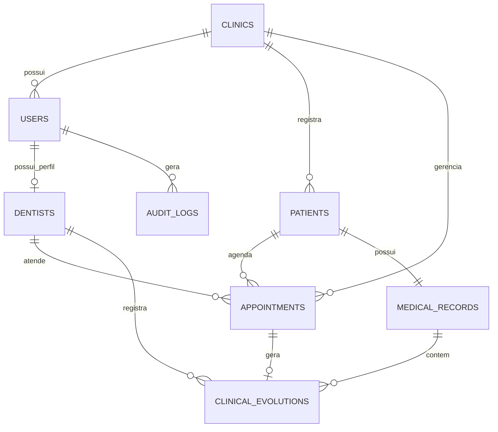

# Banco de Dados — Lumina Odonto

## 1. Objetivo

Este documento descreve a estrutura do banco de dados do sistema Lumina Odonto.

O banco foi modelado para armazenar dados de clínicas, usuários, dentistas, pacientes, agendamentos, prontuários, evoluções clínicas e registros de auditoria.

A estrutura foi planejada para atender à clínica odontológica atual e permitir a expansão do sistema para outras clínicas no futuro.

## 2. Tecnologia utilizada

| Item | Definição |
|---|---|
| Sistema gerenciador de banco de dados | PostgreSQL |
| Banco de dados local | `clinic_management` |
| ORM utilizado pela API | SQLAlchemy |
| Driver PostgreSQL utilizado pela API | Psycopg |
| Script de criação da estrutura | `backend/database/schema.sql` |
| Ferramenta utilizada para visualização | DBeaver |

## 3. Visão geral do modelo

O banco foi estruturado com uma abordagem relacional.

Cada tabela representa uma entidade do sistema. As relações entre as tabelas são estabelecidas por chaves primárias e chaves estrangeiras.

As entidades principais são:

- Clínicas;
- Usuários;
- Dentistas;
- Pacientes;
- Agendamentos;
- Prontuários;
- Evoluções clínicas;
- Registros de auditoria.



## 4. Entidades do banco de dados

### 4.1 `clinics`

Armazena os dados cadastrais das clínicas atendidas pelo sistema.

Principais atributos:

- `id`: identificador da clínica;
- `name`: nome da clínica;
- `cnpj`: CNPJ;
- `phone`: telefone;
- `email`: e-mail;
- `address`: endereço;
- `is_active`: indica se a clínica está ativa;
- `created_at`: data de criação;
- `updated_at`: data da última atualização.

### 4.2 `users`

Armazena os usuários internos do sistema.

Um usuário pode possuir o perfil de administrador, recepcionista ou dentista.

Principais atributos:

- `id`: identificador do usuário;
- `clinic_id`: clínica à qual o usuário pertence;
- `full_name`: nome completo;
- `email`: e-mail utilizado para login;
- `password_hash`: senha armazenada em formato criptografado;
- `cpf`: CPF do usuário;
- `phone`: telefone;
- `role`: perfil de acesso;
- `is_active`: indica se o usuário está ativo;
- `created_at`: data de criação;
- `updated_at`: data da última atualização.

Os perfis permitidos são:

- `ADMINISTRATOR`;
- `RECEPTIONIST`;
- `DENTIST`.

### 4.3 `dentists`

Armazena os dados profissionais específicos dos dentistas.

A separação entre `users` e `dentists` evita repetir dados comuns, como nome, e-mail, senha e CPF.

Principais atributos:

- `id`: identificador do dentista;
- `user_id`: usuário associado ao dentista;
- `cro_number`: número do CRO;
- `cro_state`: unidade federativa do CRO;
- `specialty`: especialidade odontológica;
- `created_at`: data de criação;
- `updated_at`: data da última atualização.

### 4.4 `patients`

Armazena os dados cadastrais dos pacientes da clínica.

Principais atributos:

- `id`: identificador do paciente;
- `clinic_id`: clínica responsável pelo cadastro;
- `full_name`: nome completo;
- `cpf`: CPF;
- `medical_record_number`: número do prontuário;
- `birth_date`: data de nascimento;
- `phone`: telefone;
- `email`: e-mail;
- `address`: endereço;
- `is_active`: indica se o paciente está ativo;
- `created_at`: data de criação;
- `updated_at`: data da última atualização.

### 4.5 `appointments`

Armazena os agendamentos de consultas odontológicas.

Principais atributos:

- `id`: identificador do agendamento;
- `clinic_id`: clínica responsável pelo agendamento;
- `dentist_id`: dentista responsável pelo atendimento;
- `patient_id`: paciente atendido;
- `scheduled_at`: data e horário agendado;
- `status`: situação do agendamento;
- `notes`: observações;
- `duration_minutes`: duração prevista;
- `created_at`: data de criação;
- `updated_at`: data da última atualização.

### 4.6 `medical_records`

Armazena o prontuário de cada paciente.

Principais atributos:

- `id`: identificador do prontuário;
- `patient_id`: paciente proprietário do prontuário;
- `opened_at`: data de abertura;
- `general_notes`: observações gerais;
- `created_at`: data de criação;
- `updated_at`: data da última atualização.

### 4.7 `clinical_evolutions`

Armazena os registros clínicos realizados ao longo dos atendimentos.

Principais atributos:

- `id`: identificador da evolução;
- `medical_record_id`: prontuário relacionado;
- `dentist_id`: dentista responsável pelo registro;
- `appointment_id`: agendamento relacionado;
- `recorded_at`: data e horário do registro;
- `status`: situação da evolução;
- `description`: descrição clínica;
- `procedure_performed`: procedimento realizado;
- `notes`: observações;
- `finalized_at`: data de finalização;
- `created_at`: data de criação;
- `updated_at`: data da última atualização.

### 4.8 `audit_logs`

Armazena registros de ações realizadas pelos usuários no sistema.

Principais atributos:

- `id`: identificador do registro;
- `user_id`: usuário que realizou a ação;
- `action`: ação executada;
- `resource`: recurso afetado;
- `ip_address`: endereço IP da requisição;
- `details`: detalhes da ação;
- `occurred_at`: data e horário da ocorrência.

## 5. Relacionamentos e cardinalidades

### 5.1 O que significa cardinalidade

A cardinalidade indica quantos registros de uma entidade podem se relacionar com registros de outra entidade.

| Notação | Significado |
|---|---|
| `1:1` | Um registro se relaciona com somente um registro do outro lado |
| `1:N` | Um registro se relaciona com vários registros do outro lado |
| `0:1` | O relacionamento pode não existir ou existir somente uma vez |
| `0:N` | O relacionamento pode não existir ou existir várias vezes |

## 6. Relações `1:N` do sistema

### Clínica e usuários

```text
Uma clínica possui vários usuários.
Cada usuário pertence a somente uma clínica.
```

Cardinalidade:

```text
CLINICS 1:N USERS
```

A chave estrangeira `clinic_id` está na tabela `users`.

Exemplo: uma clínica pode ter um administrador, duas recepcionistas e vários dentistas.

### Clínica e pacientes

```text
Uma clínica possui vários pacientes.
Cada paciente pertence a somente uma clínica.
```

Cardinalidade:

```text
CLINICS 1:N PATIENTS
```

A chave estrangeira `clinic_id` está na tabela `patients`.

Essa relação também permite que o sistema suporte várias clínicas sem misturar os pacientes cadastrados.

### Clínica e agendamentos

```text
Uma clínica gerencia vários agendamentos.
Cada agendamento pertence a somente uma clínica.
```

Cardinalidade:

```text
CLINICS 1:N APPOINTMENTS
```

A chave estrangeira `clinic_id` está na tabela `appointments`.

### Dentista e agendamentos

```text
Um dentista pode atender vários agendamentos.
Cada agendamento possui um dentista responsável.
```

Cardinalidade:

```text
DENTISTS 1:N APPOINTMENTS
```

A chave estrangeira `dentist_id` está na tabela `appointments`.

### Paciente e agendamentos

```text
Um paciente pode possuir vários agendamentos.
Cada agendamento está relacionado a somente um paciente.
```

Cardinalidade:

```text
PATIENTS 1:N APPOINTMENTS
```

A chave estrangeira `patient_id` está na tabela `appointments`.

### Prontuário e evoluções clínicas

```text
Um prontuário pode conter várias evoluções clínicas.
Cada evolução clínica pertence a somente um prontuário.
```

Cardinalidade:

```text
MEDICAL_RECORDS 1:N CLINICAL_EVOLUTIONS
```

A chave estrangeira `medical_record_id` está na tabela `clinical_evolutions`.

Essa relação permite registrar diversas consultas, procedimentos e observações clínicas ao longo do tempo.

### Dentista e evoluções clínicas

```text
Um dentista pode registrar várias evoluções clínicas.
Cada evolução clínica é registrada por somente um dentista.
```

Cardinalidade:

```text
DENTISTS 1:N CLINICAL_EVOLUTIONS
```

A chave estrangeira `dentist_id` está na tabela `clinical_evolutions`.

### Usuário e registros de auditoria

```text
Um usuário pode gerar vários registros de auditoria.
Cada registro de auditoria está relacionado a somente um usuário.
```

Cardinalidade:

```text
USERS 1:N AUDIT_LOGS
```

A chave estrangeira `user_id` está na tabela `audit_logs`.

## 7. Relações `1:1` do sistema

### Usuário e dentista

```text
Um usuário pode possuir nenhum ou um perfil de dentista.
Cada dentista está associado a somente um usuário.
```

Cardinalidade:

```text
USERS 1:0..1 DENTISTS
```

A tabela `dentists` utiliza a chave estrangeira `user_id`.

Esse relacionamento existe porque todo dentista é um usuário do sistema, mas nem todo usuário é um dentista. Administradores e recepcionistas não precisam possuir registro na tabela `dentists`.

### Paciente e prontuário

```text
Cada paciente possui somente um prontuário.
Cada prontuário pertence a somente um paciente.
```

Cardinalidade:

```text
PATIENTS 1:1 MEDICAL_RECORDS
```

A tabela `medical_records` utiliza a chave estrangeira `patient_id`.

Esse relacionamento garante que todas as evoluções clínicas de um paciente sejam concentradas em um único prontuário.

### Agendamento e evolução clínica

```text
Um agendamento pode não gerar uma evolução clínica.
Quando uma evolução é registrada, ela está relacionada a somente um agendamento.
```

Cardinalidade:

```text
APPOINTMENTS 1:0..1 CLINICAL_EVOLUTIONS
```

Um agendamento pode ser cancelado ou não realizado. Por esse motivo, ele pode não possuir uma evolução clínica.

## 8. Chaves e restrições

### Chaves primárias

Todas as tabelas possuem uma chave primária chamada `id`.

A chave primária identifica cada registro de forma única.

### Chaves estrangeiras

As chaves estrangeiras conectam as tabelas e garantem a integridade dos dados.

Principais chaves estrangeiras:

| Tabela | Chave estrangeira | Tabela relacionada |
|---|---|---|
| `users` | `clinic_id` | `clinics` |
| `dentists` | `user_id` | `users` |
| `patients` | `clinic_id` | `clinics` |
| `appointments` | `clinic_id` | `clinics` |
| `appointments` | `dentist_id` | `dentists` |
| `appointments` | `patient_id` | `patients` |
| `medical_records` | `patient_id` | `patients` |
| `clinical_evolutions` | `medical_record_id` | `medical_records` |
| `clinical_evolutions` | `dentist_id` | `dentists` |
| `clinical_evolutions` | `appointment_id` | `appointments` |
| `audit_logs` | `user_id` | `users` |

### Restrições de unicidade

O banco possui restrições para impedir cadastros duplicados.

| Regra | Finalidade |
|---|---|
| CNPJ da clínica único | Evita duplicidade de clínicas |
| E-mail de usuário único | Evita duplicidade de login |
| CPF de usuário único | Evita duplicidade de usuários |
| Usuário único para cada dentista | Garante um perfil profissional por usuário |
| CRO e UF únicos | Evita duplicidade de registro profissional |
| CPF de paciente único por clínica | Evita duplicidade de paciente na mesma clínica |
| Número de prontuário único por clínica | Evita duplicidade de prontuário na mesma clínica |

## 9. Integridade e segurança dos dados

A estrutura do banco aplica regras para manter os dados consistentes.

- Usuários e pacientes precisam estar vinculados a uma clínica;
- Senhas não são armazenadas em texto puro;
- O campo `password_hash` armazena apenas o hash da senha;
- Usuários inativos não devem conseguir autenticar-se;
- Pacientes são inativados por meio do campo `is_active`;
- A inativação lógica preserva o histórico do paciente;
- Chaves estrangeiras impedem registros sem relacionamento válido;
- Campos de data de criação e atualização ajudam no rastreamento das alterações.

## 10. Situação atual da implementação

O banco de dados já possui a estrutura completa para as entidades planejadas.

Na Sprint 4, a API utiliza diretamente as entidades:

- `clinics`;
- `users`;
- `patients`.

As tabelas abaixo permanecem preparadas para as próximas etapas:

- `dentists`;
- `appointments`;
- `medical_records`;
- `clinical_evolutions`;
- `audit_logs`.

## 11. Modelo Entidade-Relacionamento

> Inserir aqui a imagem ou o link do Modelo Entidade-Relacionamento produzido na Sprint 2.

## 12. Modelo Relacional

> Inserir aqui a imagem ou o link do Modelo Relacional gerado no DBeaver.

## 13. Arquivos relacionados

- `backend/database/schema.sql`;
- Modelo Entidade-Relacionamento;
- Modelo Relacional;
- Documento de Arquitetura do Sistema;
- Documentação da API;
- README do back-end.